 

## 👨‍💻 About Me

Full Stack Developer with **8 years** of experience building scalable, high-performance web applications across media, OTT/streaming, healthcare, and AI SaaS. I specialize in **React.js / Next.js**, **Node.js / Fastify**, and integrating **LLMs (Anthropic Claude API)** into real production workflows — resume parsing, AI scoring, and autonomous interview agents.

Currently building **HireHub**, an AI-powered ATS and hiring platform, as my flagship project — and delivering client work through **Wrocus Technologies** for major Indian media companies.

- 🔭 Currently building **[HireHub](https://github.com/ashishdiwedi7600/hirehub)** — an AI-powered ATS with resume parsing, JD scoring, and AI interview agents
- 🌱 Deep-diving into **Node.js internals**, **BullMQ**, and **microservices architecture**
- 💼 Delivering production systems for **Times of India, HT Media (OTTplay), Network18**
- 🎯 5+ client engagements spanning media, healthcare, OTT, and AI SaaS
- 📫 Reach me at **ashishdiwedi7600@gmail.com**

 

## 🛠️ Tech Stack

**Frontend**
 

**Backend**
 

**AI / LLM**
 

**Databases & Cloud**
 

**Testing & Tools**
 

 

## 🚀 Flagship Project — HireHub

**AI-Powered ATS & Hiring Platform** · `Next.js 14` `Fastify` `MongoDB` `Redis` `BullMQ` `Claude API` `Judge0` `Socket.io`

> An end-to-end hiring platform built solo, from architecture to deployment.

| Feature | Details |
|---|---|
| 🤖 **AI Resume Parsing** | Claude Haiku extracts structured candidate profiles from raw PDF/DOCX resumes at 95%+ accuracy |
| 🎯 **JD-to-Candidate Scoring** | Claude Sonnet evidence-based rubric matching, deterministic JSON output (temp: 0) |
| 🗣️ **AI Interview Agent** | 15-min async voice/text screening calls, BullMQ-driven post-interview scorecards |
| 🔒 **Proctored Assessments** | Tab/focus detection, copy-paste blocking, real-time violation streaming via Socket.io |
| 🛡️ **Anti-Sharing Security** | JWT `jti` rotation, IP/UA fingerprinting, one-active-session enforcement |

  

 

## 💼 Client Work — Wrocus Technologies

| Client | Project | Impact |
|---|---|---|
| **Times of India Group** | BombayTimes, TOIFA, TFNA | Next.js SSR for 10M+ monthly users, 40% faster loads |
| **HT Media** | OTTplay Streaming Platform | Custom Video.js player (DRM, HLS) across 10+ providers |
| **Network18** | News18 Regional Websites | SSR/SSG portals in 4 languages (Hindi, Tamil, Telugu, Bengali) |
| **MysteraHealth** | Telehealth Platform | HIPAA/GDPR-compliant, Azure ACS video consultations |
| **Humonics Global** | Call AI | Node.js REST APIs, 80%+ test coverage |

 

## 📊 GitHub Stats

  
  

 

## 🏆 Key Achievements

- 🏗️ Built end-to-end AI hiring platform (**HireHub**) with LLM resume parsing, ATS scoring, AI interviews, and proctoring
- 📈 Scaled TOI platforms for **10M+ users** — 40% faster loads via Redis, Lambda, and Core Web Vitals tuning
- 🎬 Built production **Video.js player** (DRM, HLS, multi-language) + Reels/Shorts player for OTTplay
- 🌐 SEO-optimized Next.js SSR/SSG portals across **News18 regional sites** (4 languages)
- 🏥 Delivered **HIPAA/GDPR-compliant** telehealth platform with Azure ACS video consultations

 

### 📫 Let's Connect

